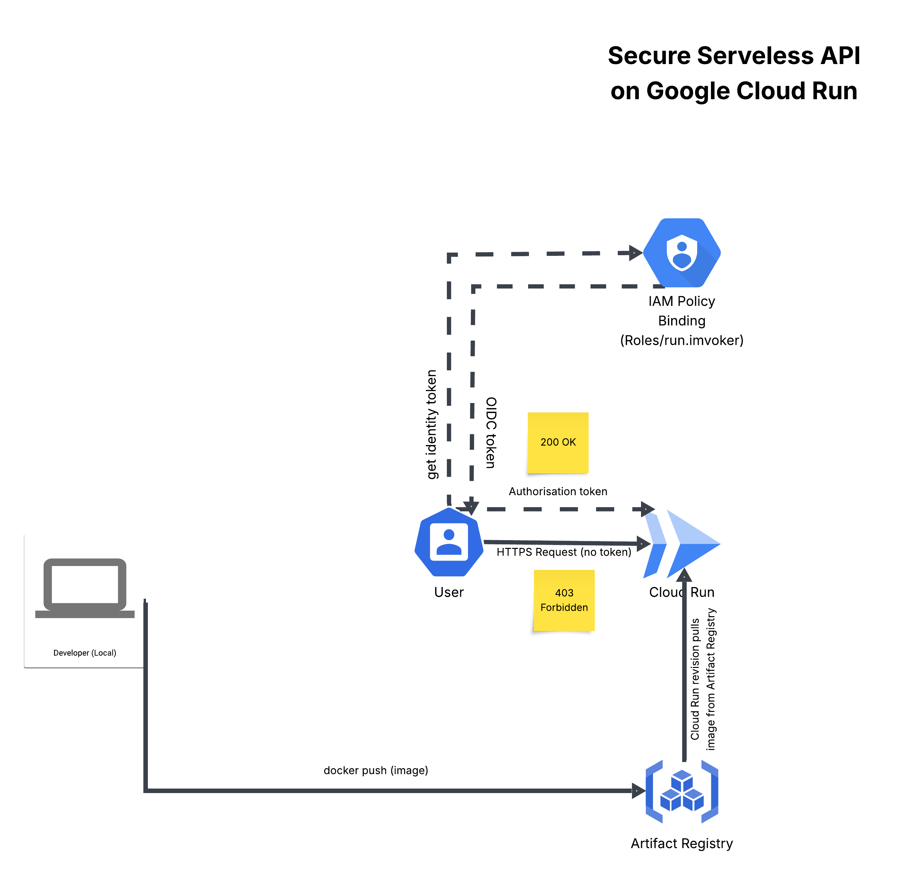
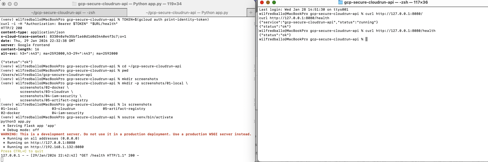
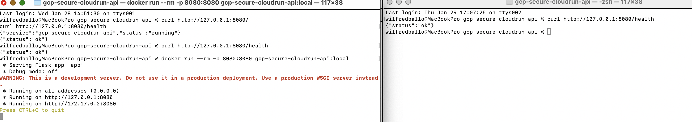
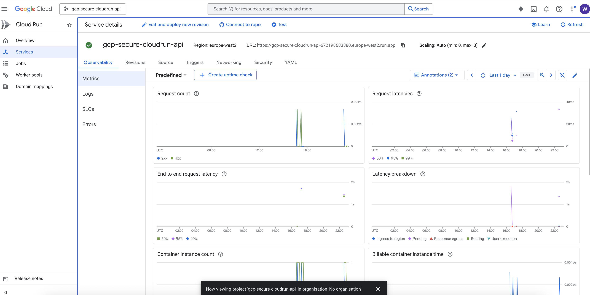
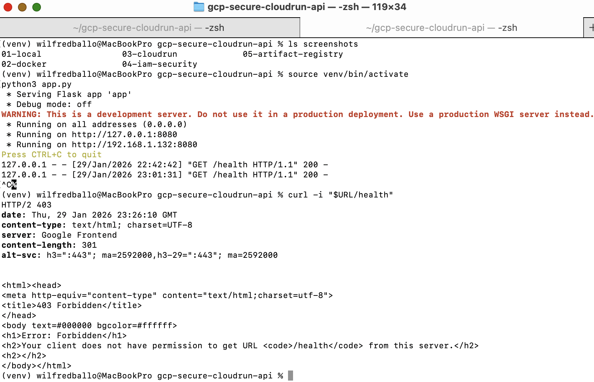
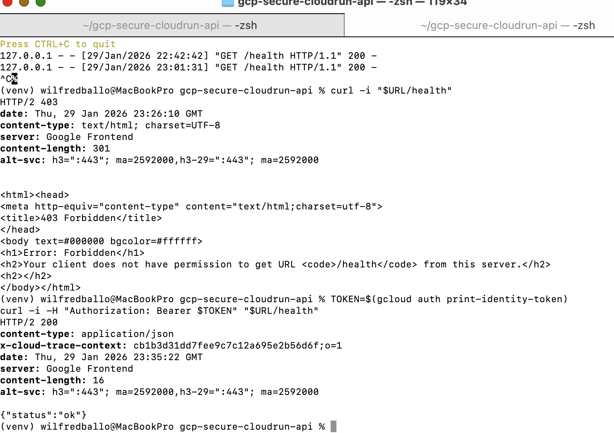
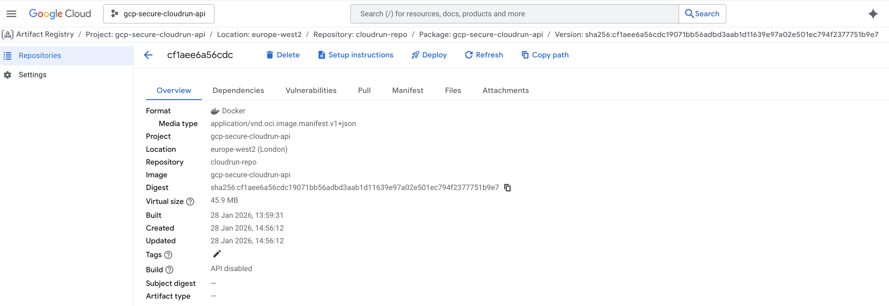

# Secure Cloud Run API on Google Cloud (IAM-Protected)

## Architecture Overview
This solution uses a serverless architecture built around Cloud Run and Artifact Registry.

## Overview
This project demonstrates how to design, deploy, and secure a containerised API on Google Cloud Run using modern cloud-native security principles.

The focus is on:
- Secure-by-default serverless architecture
- IAM-based access control
- Token-based authentication
- Cost-efficient, production-ready design

---

High-level components:
- Flask API (Python)
- Docker container
- Artifact Registry
- Cloud Run (fully managed)
- IAM (Identity & Access Management)

---

## Architecture Diagram
> Diagram created using Lucidchart (Google Cloud official icons)



---

## Goals

This project demonstrates a secure-by-default serverless API on Google Cloud using Cloud Run and IAM.
Key goals:

- Deploy a containerized API to Cloud Run
- Enforce authentication using IAM (no public access)
- Validate access patterns (403 without token, 200 with token)
- Keep infrastructure cost-safe with teardown steps

---

## Architecture Overview

**High-level flow:**
1. Developer builds the container image locally with Docker
2. Image is pushed to **Artifact Registry**
3. **Cloud Run** deploys a new revision referencing that image
4. Public (unauthenticated) requests return **403 Forbidden**
5. Authenticated requests with a valid **OIDC identity token** return **200 OK**

**Security posture:**
- Cloud Run is **NOT** configured for public access
- Access is controlled via **IAM role `roles/run.invoker`**
- Token-based authentication is required for invocation

---

## Security Model (Why this is secure)

### Authentication
Cloud Run requires a valid identity token (OIDC) to invoke the service.
- Without token → **403 Forbidden**
- With token → **200 OK**

### Authorization (Least Privilege)
Access is granted only to specific principals via:
- `roles/run.invoker`

No broad “allUsers” access is permitted.

### Threats addressed
- Prevents anonymous/public invocation
- Reduces accidental exposure of endpoints
- Enforces least privilege by default

---

## Verification Evidence

### Local Development
Local Flask API running successfully.



---

### Docker Container
Application running inside a local Docker container.



---

### Cloud Run Deployment
Service deployed successfully to Cloud Run.



---

### IAM Security Enforcement

Unauthenticated request blocked (expected behavior).



Authenticated request allowed using identity token.



---

### Artifact Registry
Container image stored securely in Artifact Registry.



---

### Architecture Diagram
High-level secure serverless architecture.


This project includes screenshots proving:

- Local Flask API running
- Docker container running locally
- Cloud Run deployment successful
- IAM locked down (403 without token)
- Successful invocation using token (200)
- Artifact Registry image present
- Cost-safe teardown completed

Screenshots are stored in `./screenshots/`.

---

## Security Architecture & Controls
#### Security Objectives

This project is designed to demonstrate a secure-by-default serverless API architecture on Google Cloud, with a strong emphasis on:

- Zero public exposure
- Strong identity-based access control
- Secretless CI/CD
- Least-privilege permissions
- Cost-safe operations and clean teardown

The architecture intentionally avoids common anti-patterns such as public Cloud Run services, long-lived service account keys, and over-privileged CI/CD pipelines.

#### Threat Model

The design assumes the following realistic threats:
- Attackers discovering the Cloud Run service URL and attempting direct access
- Accidental public exposure of APIs via misconfiguration
- Leakage of CI/CD credentials or service account keys
- Unauthorized deployments from compromised or untrusted pipelines
- Supply-chain risks during container build and deployment
  
All security controls are implemented to mitigate these risks.

#### Cloud Run Access Control (Private by Default)
Decision:

- The Cloud Run service is deployed without unauthenticated access.

Implementation:

- --no-allow-unauthenticated is enforced at deploy time
- Requests without a valid identity token return HTTP 403 Forbidden

Security Benefit:

- The service URL alone is useless to an attacker
- Prevents accidental public API exposure
- Enforces identity before any application logic is reached

Verification:

- Unauthenticated request → 403 Forbidden
- Authenticated request with valid identity token → 200 OK

#### IAM-Based Authorization (Least Privilege)
Decision:

- Access to invoke the Cloud Run service is controlled using IAM.

Implementation:

- Only principals with roles/run.invoker can call the service
- No wildcard or project-wide permissions are granted

Security Benefit:

- Authentication proves who you are
- IAM determines what you are allowed to do
- Prevents lateral access by authenticated but unauthorized identities

#### Workload Identity Federation for CI/CD (No Secrets)
Decision:

- GitHub Actions authenticates to Google Cloud using OIDC Workload Identity Federation, not service account keys.

Implementation:

- GitHub Actions issues a short-lived OIDC token
- Google Cloud exchanges the token for temporary credentials
- No JSON keys are stored in GitHub Secrets

Security Benefit:

- Eliminates long-lived credentials entirely
- Tokens are short-lived and automatically rotated
- Stolen pipeline logs cannot be reused for access

#### Repository-Scoped Trust Policy
Decision:

- The Workload Identity Provider only trusts a single GitHub repository.

Implementation:

- Attribute conditions restrict federation to:
-- repository = wilfb-debug/gcp-secure-cloudrun-api
- Requests from other repositories are rejected

Security Benefit:

- Prevents identity reuse from forked or malicious repositories
- Ensures only the intended pipeline can deploy infrastructure
- Enforces strong provenance of deployments

#### Secure Container Supply Chain
Decision:

- Container images are built and stored in Artifact Registry, then deployed to Cloud Run.

Implementation:

- Images are versioned and immutable
- Cloud Run pulls images directly from Artifact Registry
- No inline builds on the runtime environment

Security Benefit:

- Clear separation between build and runtime
- Enables auditing, rollback, and future signing/scanning
- Reduces risk of runtime tampering

#### Cost and Operational Safety
Decision:

- The project is intentionally designed to be cost-safe.

Implementation:

- Cloud Run services can be fully deleted when idle
- Artifact Registry repositories are removable after use
- No always-on compute resources

Security Benefit:

- Prevents cost leakage
- Encourages clean lifecycle management
- Reduces attack surface when not actively in use

#### Security Posture Summary
This architecture demonstrates:

- Zero public endpoints
- Identity-first access control
- Secretless CI/CD
- Least privilege IAM
- Auditable container delivery
- Operational cost discipline

It reflects production-grade security principles suitable for regulated and enterprise environments.

#### Future Hardening (Out of Scope)

If extended further, the architecture could include:

- Container image signing (Cosign / SLSA)
- Vulnerability scanning and policy enforcement
- Infrastructure as Code (Terraform)
- Centralized logging, metrics, and alerting
- Multi-region or compliance-driven deployments

---

## Operations Runbook

### Deploy (high level)
1. Build Docker image
2. Push image to Artifact Registry
3. Deploy to Cloud Run with IAM enforced

### Test endpoints
- `/health` returns `{"status":"ok"}`
- `/` returns service status JSON

### Cost-safe teardown
Cloud Run service + Artifact Registry repo are deleted after validation.

---

## Limitations

- Token auth is tested using `gcloud auth print-identity-token` (developer identity)
- No CI/CD pipeline yet (added in Phase 4)
- No automated vulnerability scanning enabled for the registry (optional enhancement)

---

## Roadmap / Next Improvements

Planned upgrades:

- CI/CD with GitHub Actions
- Workload Identity Federation (no long-lived service account keys)
- Automated deploy to Cloud Run on merge to main
- Container image scanning + policy checks
- Structured logging and monitoring (Cloud Logging + Error Reporting)

---

## Local Development
The API is developed and tested locally using Python virtual environments and Docker.

### Local Flask Test


---

## Containerisation with Docker
The application is packaged as a Docker container to ensure environment consistency across local and cloud environments.

### Docker Image Build & Run


---

## Deployment to Cloud Run
The container image is pushed to Google Artifact Registry and deployed to Cloud Run.

### Cloud Run Service


---

## Security & IAM Enforcement
Public access is explicitly disabled. Requests require a valid identity token issued by Google IAM.

### Unauthenticated Request (403 Forbidden)


### Authenticated Request (200 OK)


---

## Artifact Registry
Docker images are stored securely in Artifact Registry.

### Stored Container Image


---

## Cost Management
The project is designed to be cost-safe:
- Serverless infrastructure
- Zero idle compute
- Services can be fully torn down without losing code or evidence

---

## Cost-Safe Teardown & Cleanup

To prevent unnecessary cloud costs after testing and validation, all deployed resources were safely removed.

### Cloud Run Service Cleanup
The Cloud Run service was deleted to stop any active or idle compute usage.

```bash
REGION=europe-west2
SERVICE=gcp-secure-cloudrun-api

gcloud run services delete $SERVICE \
  --region $REGION \
  --quiet
---

## Key Learnings
- Secure Cloud Run services using IAM
- Use identity tokens for zero-trust API access
- Build cost-efficient serverless architectures
- Structure production-ready cloud projects

---

## Technologies Used
- Google Cloud Run
- Google Artifact Registry
- Google IAM
- Docker
- Python (Flask)
- gcloud CLI
